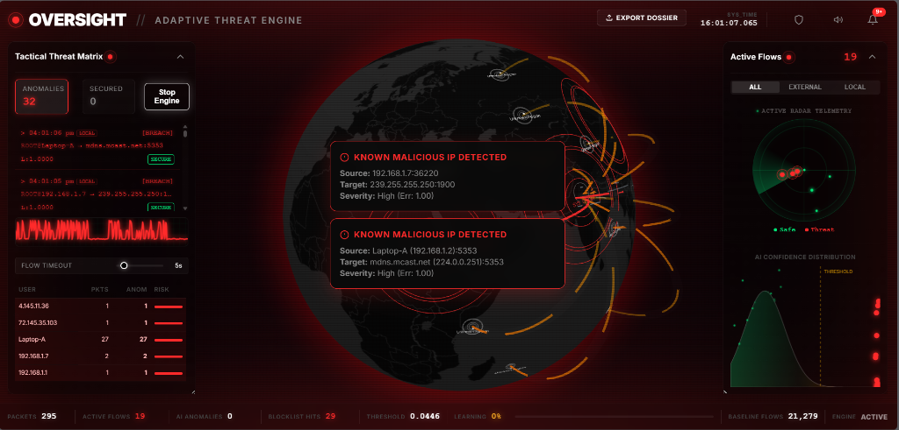

# OVERSIGHT: Adaptive Threat Engine

[](https://www.python.org/downloads/)
[](https://opensource.org/licenses/MIT)
[](https://flask.palletsprojects.com/)
[](https://onnx.ai/)

**OVERSIGHT** is a real-time network security monitoring system that bridges the gap between traditional rule-based firewalls and modern behavioral analysis. It utilizes a **Symmetric Feed-Forward Autoencoder** to identify sophisticated network anomalies that bypass standard signature-based detection.

---

## 🖥️ Dashboard Interface

Below is a preview of the high-fidelity bento-grid OVERSIGHT threat monitoring dashboard in action:



---

## 🚀 Key Technical Highlights

### 1. AI-Driven Behavioral Analysis
- **Unsupervised Learning**: Implements a deep learning autoencoder trained exclusively on "normal" network traffic.
- **Anomaly Detection**: Identifies threats by measuring the **Reconstruction Error (MSE)**; statistical outliers are flagged as potential zero-day exploits.
- **ONNX Optimization**: Models are exported to ONNX format for hardware-accelerated, sub-millisecond inference on consumer hardware.

### 2. Multi-Stage Detection Pipeline
- **Stage 1 (Signature)**: Cross-references live flows against the **FireHOL Threat Intelligence** blocklist.
- **Stage 2 (Behavioral)**: Processes 14-dimensional feature vectors (derived from the UNSW-NB15 standard) through the AI engine.

### 3. Adaptive Learning Loop
- **Autonomous Evolution**: Verification of "Normal" flows triggers background retraining sessions.
- **Hot-Swapping**: New models and scalers are integrated into the live system without service interruption using thread-safe synchronization.

### 4. Interactive 3D Globe Threat Focus & Auto-Pan
- **Auto-Pan & Zoom**: Clicking on any threat vector in the left panel, anomaly toasts, or the alert history overlay dynamically plots the arc on the 3D globe and animates the camera to zoom into the remote target coordinates.
- **Dynamic Arc Restoration**: The system automatically recovers and renders expired/pruned arcs instantly when an analyst clicks on an event in the dashboard logs.

### 5. Local Traffic Visual Differentiation
- **Subnet Badging**: Live network vectors and whitelisted exception bypass rules are continuously analyzed against private subnets (`127.x.x.x`, `10.x.x.x`, `192.168.x.x`, etc.) and automatically labeled with context-colored `LOCAL` badges.

---

## 🛠️ Tech Stack

- **Backend**: Python 3.10+, Flask, Flask-SocketIO (WebSockets)
- **Networking**: Scapy (NDIS driver-level packet interception)
- **AI/ML**: ONNX Runtime, Scikit-learn, NumPy, Pandas
- **Frontend**: Vanilla HTML5, CSS3 (Bento Grid Layout), JavaScript (ES6+), Globe.gl (Three.js/WebGL)

---

## 📦 Getting Started

### Prerequisites
- **Windows**: [Npcap](https://npcap.com/) is required for raw packet capture.
- **Privileges**: Must be run as **Administrator** to access network sockets.

### Installation
1. **Clone the repository**:
   ```bash
   git clone https://github.com/apoorv-xs/Oversight.git
   cd Oversight
   ```

2. **Install dependencies**:
   ```bash
   pip install -r requirements.txt
   ```

3. **Launch the Engine**:
   ```bash
   python run.py
   ```
   Access the dashboard at `http://localhost:5000`.

---

## 🏗️ Architecture Overview

OVERSIGHT is designed with a modular, thread-safe architecture:

- **Capture Engine**: A dedicated background thread utilizing Scapy's sniffer to feed a shared thread-safe queue.
- **Feature Extractor**: Aggregates raw packets into bidirectional 5-tuple flows using a 5-second inactivity timeout.
- **Inference Engine**: Performs high-speed normalization and ONNX inference to calculate real-time risk scores.
- **WebSocket Gateway**: Streams telemetry and anomaly alerts to the frontend with sub-50ms latency.

---

## 🛡️ License

Distributed under the MIT License. See `LICENSE` for more information.

---

*Built as a Major Project for the Bachelor of Technology (B.Tech) program.*
