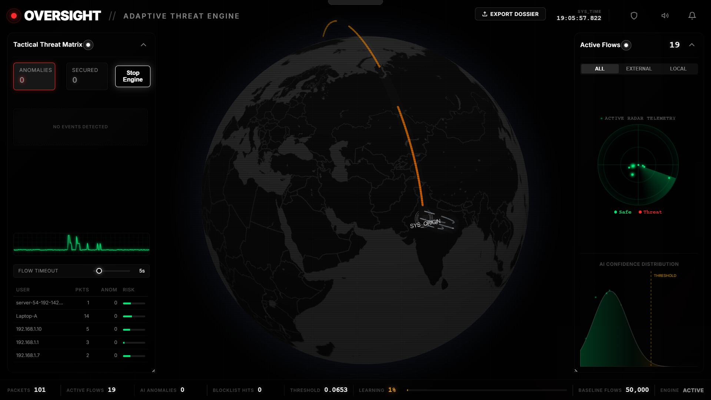

# OVERSIGHT

An interactive, real-time network threat monitoring console. It translates raw network capture into a high-fidelity visual dashboard, pairing a modular threat engine with a WebGL 3D globe to map network traffic and security alerts dynamically.

Built to show how network telemetry can be intuitive, responsive, and visually engaging.

<p align="center">
  
  
</p>

## 🎨 Visual & Frontend Features

- **Interactive WebGL 3D Globe**: Maps and plots incoming network vectors in real-time. When a threat is detected, the camera automatically pans and zooms to focus on the target coordinates.
- **Glassmorphic Bento Grid UI**: A modern dashboard layout utilizing clean responsive panels, status indicators, and sleek dark-mode aesthetics.
- **Custom Soundscapes**: Interactive audio cues and notifications for real-time security alerts, bringing a tactile feel to live network events.
- **Dynamic Arc Pruning & Restoration**: Caches and clears old traffic arcs proactively to keep the WebGL canvas smooth and responsive, while allowing analysts to click any alert in the log to instantly redraw its vector.
- **Smart Local Traffic Badging**: Automatically identifies private subnets (`127.x.x.x`, `10.x.x.x`, `192.168.x.x`, etc.) and marks them with dedicated `LOCAL` badges to minimize visual clutter.

## 🧠 Behind the Hood (Core Engine)

- **AI Anomaly Detection**: Implements a deep learning symmetric autoencoder trained on the UNSW-NB15 dataset. It reads 14-dimensional flow feature vectors and uses the ONNX Runtime for sub-millisecond inference on local hardware.
- **Dual-Stage Pipeline**: 
  - **Stage 1 (Signature)**: Cross-references live IPs against a locally-cached FireHOL level-1 threat intelligence blocklist (refreshed daily).
  - **Stage 2 (Behavioral)**: Passes non-blocklisted flows through the AI model to calculate reconstruction error (MSE); outliers are flagged as zero-day anomalies.
- **Adaptive Retraining Loop**: Safe flows are buffered and periodically flushed to the local baseline dataset to retrain and update the model without interrupting the capture thread.

## 📊 AI Model Benchmark

Evaluated against the [**UNSW-NB15**](https://research.unsw.edu.au/projects/unsw-nb15-dataset) test set (containing a realistic mix of normal traffic and 9 categories of synthetically-generated attack vectors) after being trained exclusively on custom/local normal network traffic baseline.

- **Training**: Autoencoder trained exclusively on custom/local normal flow (unsupervised — no attack labels used during training)
- **Test Set**: 82,332 labeled network flows (45,332 attacks + 37,000 normal) from the UNSW-NB15 dataset

| Metric | Score |
|:---|:---|
| **Threat Detection Rate (Recall)** | **99.76%** |
| **Overall Accuracy** | 61.66% |
| **True Positives** | 45,224 / 45,332 |
| **Missed Attacks (False Negatives)** | 108 |

> The model is intentionally tuned for **maximum recall** — in security, missing an attack is far more costly than a false alarm. The 99.76% detection rate means only 108 threats slipped through out of 45,332 real attacks.

### Per-Category Detection Rates

| Attack Category | Total Samples | Missed | Detection Rate |
|:---|---:|---:|---:|
| Analysis | 677 | 0 | **100.00%** |
| Fuzzers | 6,062 | 0 | **100.00%** |
| Reconnaissance | 3,496 | 0 | **100.00%** |
| Shellcode | 378 | 0 | **100.00%** |
| Worms | 44 | 0 | **100.00%** |
| Generic | 18,871 | 10 | 99.95% |
| Exploits | 11,132 | 42 | 99.62% |
| Backdoor | 583 | 6 | 98.97% |
| DoS | 4,089 | 50 | 98.78% |

### Model Architecture

```
NetworkAutoencoder (14 → 8 → 4 → 8 → 14)
├── Encoder: Linear(14,8) → ReLU → Linear(8,4) → ReLU
├── Bottleneck: 4-dimensional latent space
├── Decoder: Linear(4,8) → ReLU → Linear(8,14) → Sigmoid
├── Loss: MSE (Reconstruction Error)
└── Runtime: ONNX Runtime (sub-millisecond per flow)
```

## 🛠️ Stack


- **Frontend**: HTML5, Vanilla CSS3 (Custom Variables, Bento Grid), JavaScript (ES6), Globe.gl (Three.js/WebGL under the hood)
- **Backend**: Python 3.10+, Flask, Flask-SocketIO (WebSockets for low-latency streaming)
- **AI/ML**: ONNX Runtime, Scikit-learn, Pandas, NumPy
- **Packet Capture**: Scapy (requires Npcap driver on Windows)

## 📦 Running It Locally

### Prerequisites
- **Python**: Python 3.10+ installed.
- **Npcap Driver**: [Npcap](https://npcap.com/) is required on Windows for raw packet interception.
- **Privileges**: Run your terminal (Command Prompt/PowerShell) as **Administrator** so Scapy can bind to the network interface.

### Setup

1. **Clone and enter the repository**:
   ```bash
   git clone https://github.com/apoorv-xs/Oversight.git
   cd Oversight
   ```

2. **Create and activate a virtual environment (recommended)**:
   ```bash
   python -m venv venv
   # On Windows (Admin Command Prompt):
   venv\Scripts\activate
   # On Windows (Admin PowerShell):
   .\venv\Scripts\activate
   ```

3. **Install the dependencies**:
   ```bash
   pip install -r requirements.txt
   ```

4. **Download the GeoIP Database**:
   *(Required to map external/remote threat vectors onto the 3D globe)*
   ```bash
   python utilities/scripts/download_geoip.py
   ```

5. **Launch OVERSIGHT**:
   ```bash
   python run.py
   ```
   Open `http://localhost:5000` in your browser to view the dashboard.

## 📐 Internal Architecture

- **Sniffer Thread**: Spins up a background thread using Scapy to sniff raw packets and queue them.
- **Flow Manager**: Groups raw packets into bidirectional 5-tuple flows using an inactivity timeout.
- **Inference Gateway**: Runs real-time standardization and ONNX inference to check for MSE spikes.
- **WebSocket Gateway**: Streams live traffic stats and anomaly alerts to the browser.
